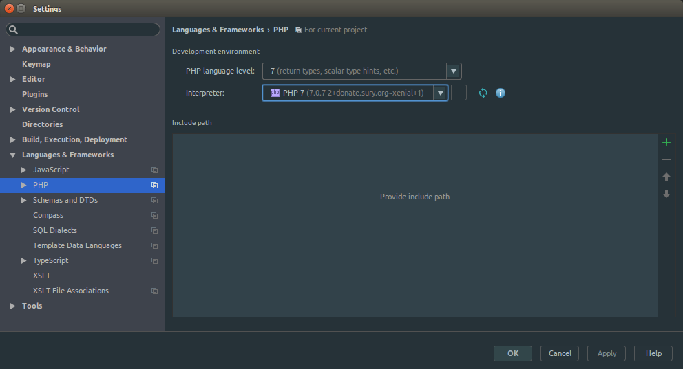

<a href="https://www.jetbrains.com/phpstorm/" target="_blank">PhpStorm</a> is one of the good IDE for PHP application development available in current era. <a href="https://xdebug.org/" target="_blank">PHP Xdebug</a> is a very strong tool for debugging, making the life easier for <a class="http://www.php.net/" target="_blank">PHP</a> developers to find out the logical mistakes.

Integration of Xdebug into <a href="https://www.jetbrains.com/phpstorm/" target="_blank">PhpStorm</a> will ease the trouble of debugging for <a class="http://www.php.net/" target="_blank">PHP</a> developers. You can easily setup <a href="https://xdebug.org/" target="_blank">Xdebug</a> in <a href="https://www.jetbrains.com/phpstorm/" target="_blank">PhpStorm</a> by following these steps.

#### Requirements

- <a href="https://www.jetbrains.com/phpstorm/" target="_blank">PhpStorm</a> (get it from <a href="https://www.jetbrains.com/phpstorm/download/" target="\_blank">here</a>)
- <a href="https://xdebug.org/" target="_blank">Xdebug</a> (get it from <a href="https://xdebug.org/download.php" target="_blank">here</a>)

#### Procedures

- Setup <a href="https://xdebug.org/" target="_blank">Xdebug</a> (if you haven't done already). Find the steps <a href="{{site.baseurl}}/setup-xdebug-in-ubuntu/" target="_blank">here</a>.
  You should be able to see <a href="https://xdebug.org/" target="_blank">Xdebug</a> while checking the php version.

```shell
$ php --version
PHP 7.0.7-2+donate.sury.org~xenial+1 (cli) ( NTS )
Copyright (c) 1997-2016 The PHP Group
Zend Engine v3.0.0, Copyright (c) 1998-2016 Zend Technologies
    with Zend OPcache v7.0.6-dev, Copyright (c) 1999-2016, by Zend Technologies
    with Xdebug v2.4.0, Copyright (c) 2002-2016, by Derick Rethans
```

- Now, configure xdebug for debugging. You need to change the `xdebug.ini` file. You can find the location of file using this command using terminal: `php --ini | grep xdebug`.

Mine returned like this:

```shell
$ php --ini | grep xdebug
/etc/php/7.0/cli/conf.d/20-xdebug.ini,
```

- Just copy the path of the file and open in your favourite text editor (<a href="https://www.sublimetext.com/" target="_blank">Sublime Text</a> for me). Don't forget to use `sudo` to edit the file otherwise, you won't be able to save the changes you make.

```shell
# for sublime text users
$ sudo subl /etc/php/7.0/cli/conf.d/20-xdebug.ini

# for gedit users
$ sudo gedit /etc/php/7.0/cli/conf.d/20-xdebug.ini

# for vim users
$ sudo vim /etc/php/7.0/cli/conf.d/20-xdebug.ini

# for atom users
$ sudo atom /etc/php/7.0/cli/conf.d/20-xdebug.ini
```

- Add these lines of code at the end of file.

```shell
xdebug.remote_enable=true
xdebug.remote_port="9000"   // Port for xdebug. Default is 9000.
xdebug.profiler_enable=1
xdebug.profiler_output_dir="/tmp"
```

- Time to change things in <a href="https://www.jetbrains.com/phpstorm/" target="_blank">PhpStorm</a>. Navigate to `File > Settings > Language & Frameworks > PHP`. You will see the following screen.



Click on the `...` in `Interpreters` option to see more. You will get this:


If you are not able to see `Debugger: Xdebug 2.4.0`, try to refresh by clicking the refresh button on the right of `PHP exectable`. Again, if not seen, check the status of <a href="https://xdebug.org/" target="_blank">Xdebug</a> and try again.

This shows that that <a href="https://xdebug.org/" target="_blank">Xdebug</a> is ready in <a href="https://www.jetbrains.com/phpstorm/" target="_blank">PhpStorm</a>. Save before you exit!

- Now, you need to set up a server. Navaigate to `File > Settings > Language & Framework > PHP > Servers`.


Let's add a server. Click on <span class="dark-green">+</span> icon to add. You will get the same window changed to this:


By default, it tries to create a unnamed server. Let's change this to `TEST_SERVER` and fill the other fields as well as shown below.


Choose `Xdebug` as the `Debugger` option on the right. You can choose different port (default is 80).

Save before you close the window!

- Now a server is ready, configure debug options. Navigate to `Run > Edit Configurations`.


Add new option by clicking on <span class="dark-green">+</span> icon on top left. Choose `PHP Web Application` from number of options.


You will get a unnamed configuration as shown below.


Set up a configuration for `TEST_SERVER` created earlier. I have named it to `TEST_CHROME`.


Choose the created server and appropriate browser availabe from the options. Also, you can see the url that will open in the browser.

Click on `OK` to save this.

- Now, open the project in <a href="https://www.jetbrains.com/phpstorm/" target="_blank">PhpStorm</a>.
- Set a breakpoint where you want to check your logic. To set a breakpoint, just click on the left side of the line of code. Click on the position of red round mark. Click on th same position to remove the breakpoint.


- Now open the link in your browser in debugging mode by navigating `Run > Debug 'TEST_CHROME'`. The browser may ask you to install a <a href="https://chrome.google.com/webstore/detail/jetbrains-ide-support/hmhgeddbohgjknpmjagkdomcpobmllji" target="_blank">JetBrains Extension (in Chrome)</a> in your browser.
- You will see a webpage opening in the browser you set in configurtion. Navigate to the point where you want to check your logic. When you reach to the breakpoint, the browser will keep itself in the loading position. In the mean time, you will see <a href="https://www.jetbrains.com/phpstorm/" target="_blank">PhpStorm</a> being highlighted in taskbar or focused on top with the breakpoint highlighted with different color as shown below:


You can see the debugging window right at the bottom part of <a href="https://www.jetbrains.com/phpstorm/" target="_blank">PhpStorm</a> window. You can find `Step Over`, `Step Into`, `Step Out`, `Watch` etc. controls in the Debugging Window.

See the shortcuts or set up your own shortcuts, they will help you a lot.

Hope you will feel ease to find any logical mistakes in your PHP code by debugging using <a href="https://xdebug.org/" target="_blank">Xdebug</a> in <a href="https://www.jetbrains.com/phpstorm/" target="_blank">PhpStorm</a>.
