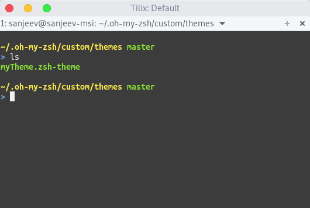

### Dropdown terminal

It seems <a href="http://guake-project.org/" target="_blank">guake</a> is an obvious choice for everyone, but <a href="https://gnunn1.github.io/tilix-web/" target="_blank">tilix</a> gives terminator features of splitting a window.

```console
$ yaourt -S tilix-bin
```

To use tilix as a dropdown terminal, you need to setup a key with `tilix -q` as action.

### Install zsh

```console
$ sudo pacman -S zsh
```

### Install git

```console
$ sudo pacman -S git
```

### Setup oh-my-zsh

```console
$ wget https://github.com/robbyrussell/oh-my-zsh/raw/master/tools/install.sh -O - | zsh
$ chsh -s `which zsh`
```

### ZSH Theme

I am using a custom theme inspired from <a href="https://github.com/robbyrussell/oh-my-zsh/wiki/themes#juanghurtado" target="_blank">juanghurtado</a>.

```console
# Color shortcuts
RED=$fg[red]
YELLOW=$fg[yellow]
GREEN=$fg[green]
WHITE=$fg[white]
BLUE=$fg[blue]
RED_BOLD=$fg_bold[red]
YELLOW_BOLD=$fg_bold[yellow]
GREEN_BOLD=$fg_bold[green]
WHITE_BOLD=$fg_bold[white]
BLUE_BOLD=$fg_bold[blue]
RESET_COLOR=$reset_color

# Format for git_prompt_info()
ZSH_THEME_GIT_PROMPT_PREFIX=""
ZSH_THEME_GIT_PROMPT_SUFFIX=""

# Format for parse_git_dirty()
ZSH_THEME_GIT_PROMPT_DIRTY=" %{$RED%}(*)"
ZSH_THEME_GIT_PROMPT_CLEAN=""

# Format for git_prompt_status()
ZSH_THEME_GIT_PROMPT_UNMERGED=" %{$RED%}unmerged"
ZSH_THEME_GIT_PROMPT_DELETED=" %{$RED%}deleted"
ZSH_THEME_GIT_PROMPT_RENAMED=" %{$YELLOW%}renamed"
ZSH_THEME_GIT_PROMPT_MODIFIED=" %{$YELLOW%}modified"
ZSH_THEME_GIT_PROMPT_ADDED=" %{$GREEN%}added"
ZSH_THEME_GIT_PROMPT_UNTRACKED=" %{$WHITE%}untracked"

# Format for git_prompt_ahead()
ZSH_THEME_GIT_PROMPT_AHEAD=" %{$RED%}(!)"

# Format for git_prompt_long_sha() and git_prompt_short_sha()
ZSH_THEME_GIT_PROMPT_SHA_BEFORE=" %{$WHITE%}[%{$YELLOW%}"
ZSH_THEME_GIT_PROMPT_SHA_AFTER="%{$WHITE%}]"

# Prompt format
PROMPT='
%{$GREEN_BOLD%}%{$YELLOW%}%~%u$(parse_git_dirty)$(git_prompt_ahead)%{$RESET_COLOR%} %{$GREEN_BOLD%}$(git_current_branch)
%{$BLUE%}>%{$RESET_COLOR%} '
```



### Reboot or log out - log in

#### References

- <a href="https://github.com/robbyrussell/oh-my-zsh/wiki/themes" target="_blank">ZSH Themes</a>
- <a href="https://gist.github.com/tsabat/1498393" target="_blank">Getting oh-my-zsh to work in Ubuntu</a>
